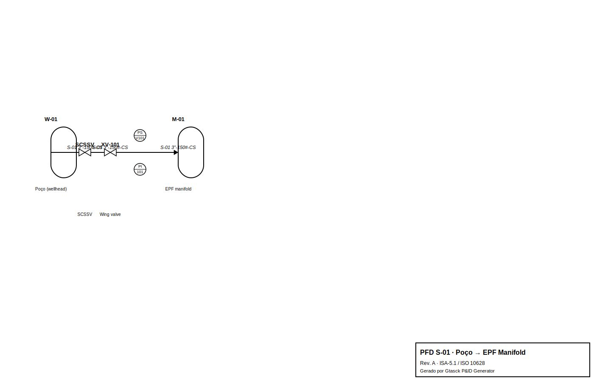
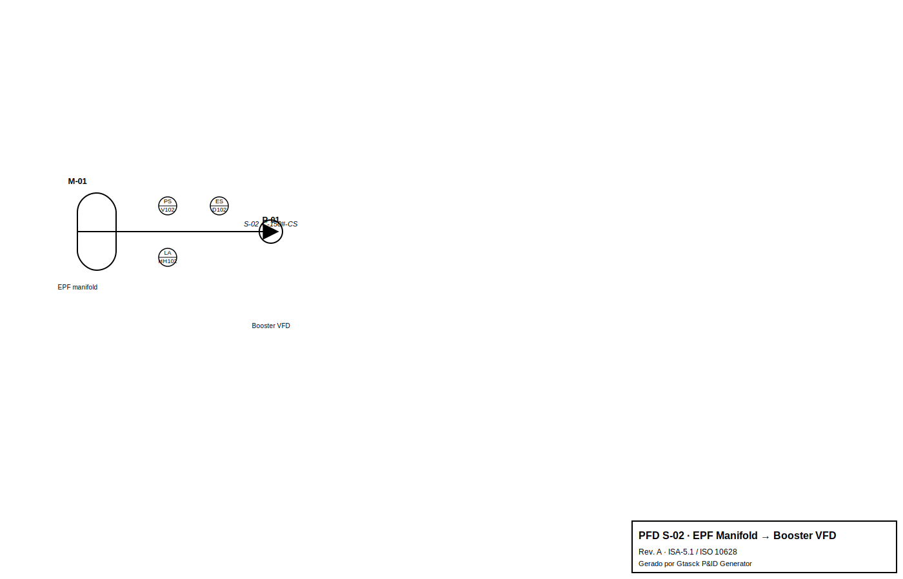
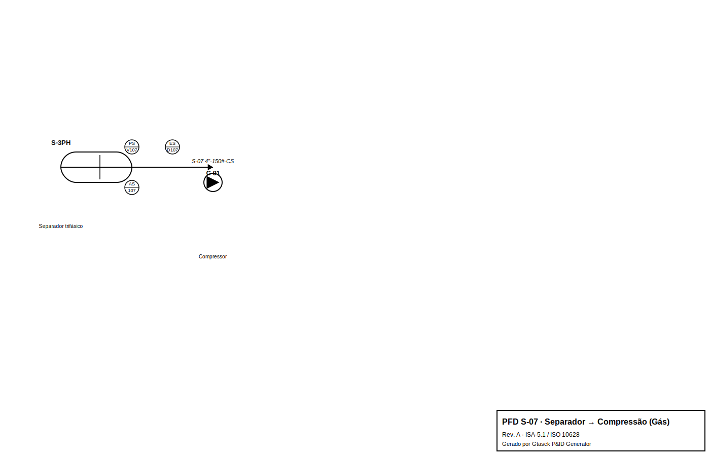
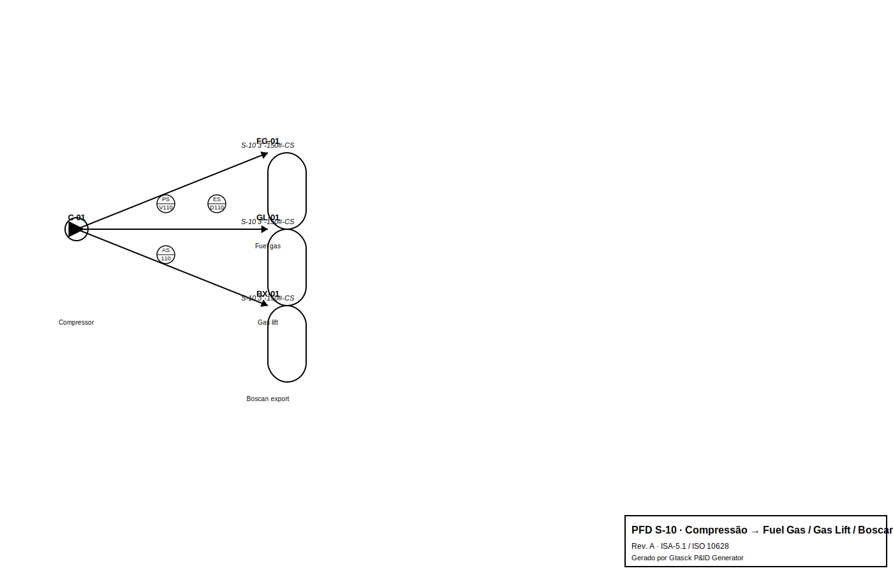

# PETRORDANETA DEVELOPMENT PLAN · FDP 9
## Field Development Plan — Documento Completo do Projeto

| Campo | Valor |
|---|---|
| **Documento** | FDP 9 — Field Development Plan |
| **Projeto** | PetroUrdaneta Development Plan |
| **Ativo** | PetroUrdaneta (JV PDVSA) — Lago de Maracaibo, Venezuela |
| **Campos** | La Paz (Fase 1), Mara, Mara West, La Paz Sur, El Moján |
| **Data de emissão** | 30 de agosto de 2026 |
| **Gerenciado por** | Gtasck (copiloto do COO) |
| **Normas** | API, NORSOK, COVENIN, venezuelanas, IEC 61511, NFPA, DNV |

---

# ÍNDICE

**Parte I — Filosofia e Intenção do Projeto**
1. Filosofia do Projeto e Intenção
2. Visão Geral do Ativo e das Metas

**Parte II — Planejamento**
3. Áreas de Planejamento (Estratégia, Fases, Metas)
4. Áreas Administrativas (Backoffice, Finanças, RH, Jurídico, TI)

**Parte III — Pessoas e Forma de Trabalhar**
5. Pessoas (Organização, Equipes, Competências)
6. Forma de Trabalhar (Processos, Governança, Rotinas)

**Parte IV — Forma de Contratar**
7. Procurement do Projeto como um Todo (MSAs, AFEs, Tender)

**Parte V — Processos**
8. Processos Mais Relevantes (Visão Geral)
9. Poços: Funcionamento, Cretáceo/Paleoceno, Fechamento Seguro
10. EPFs: Operação, Válvula Pig, Manutenção
11. Distribuição de Correntes: Gás, Óleo e Água
12. NGL: Equipamentos, Capacidade, Implementação
13. Compressão: Funcionamento e Pacotes Escaláveis
14. Process Shutdowns e Blowdown no CPF

**Parte VI — Benefícios e Riscos**
15. Benefícios do Projeto
16. Riscos e Mitigação (ALARP)

**Apêndices**
A. Registro de Esquemas · B. Entregáveis FEED · C. Requisitos de Dados · D. Pacote de Esquemas · E. Tabela de Reativação · F. Envelope de Previsão · G. Injeção de Água 2026 · H. Premissas do Plano de Negócio · I. Cromatografia de Gás 2016 · J. Registros de Assurance · K. Inventário de Fontes · L. Registro FDP v8 · M. Registro FEED

---
---

# PARTE I — FILOSOFIA E INTENÇÃO DO PROJETO

---

## 1. Filosofia do Projeto e Intenção

### 1.1 Filosofia

A filosofia do **PetroUrdaneta Development Plan** é uma **restauração e expansão modular e faseada** do sistema de produção da área de La Paz, seguida por Mara, Mara West, La Paz Sur, El Moján e oportunidades posteriores de infill. O desenvolvimento **prioriza reativação antes de infill**, uso antecipado de infraestrutura existente, EPFs autocontidos e upgrades incrementais de facilidades centrais.

> **Princípio central:** o sistema de produção é deliberadamente baseado em **fluxo multifásico normal** do poço para a EPF e da EPF para o complexo integrado FSB/CPF.

### 1.2 Intenção

A intenção do projeto é **restaurar e expandir a produção** do ativo PetroUrdaneta de forma **modular, faseada e economicamente eficiente**, com:

- **Reativação antes de infill** — maximizar o uso de poços existentes antes de perfurar novos
- **EPFs autocontidos** — cada EPF tem sua própria geração de energia, controle e boosting
- **Upgrades incrementais** — o FSB/CPF é expandido conforme a produção cresce
- **Flex pipe first** — priorizar flex pipe pigável nas trunklines (regra permanente)
- **Design modular** — manter o conceito central modular (regra permanente)

### 1.3 Princípios de segurança de processo

A segurança de processo é **integrada em cada capítulo** deste documento, não tratada separadamente. Cada processo em detalhe (Parte V) inclui os **parâmetros operacionais básicos** para garantir a segurança de processo.

---

## 2. Visão Geral do Ativo e das Metas

### 2.1 Identidade do ativo

| Campo | Valor |
|---|---|
| **Operadora** | PetroUrdaneta (JV PDVSA) |
| **Localização** | Venezuela — região do Lago de Maracaibo |
| **Campos** | La Paz (Fase 1), Mara, Mara West, La Paz Sur, El Moján |
| **OOIP / OGIP** | ~8,6 bilhões bbl / 4,6 Tcf |

### 2.2 Metas de produção (envelopes separados — NÃO somar)

| Caso | Óleo | Gás | Uso |
|---|---:|---:|---|
| Baseline La Paz atual | ~1.300 BOPD | — | Base de reinício |
| Reativação (workbook) | 4.719 BOPD | — | Triagem de poços |
| **FDP Fase 1 (referência)** | **13.500 BOPD** (teórico 14.982) | — | Sanção / Fase 1 modular |
| Portfólio PDVSA (alto) | 27–28 kbopd | 49–52 MMscfd | Sensibilidade de facilidades |
| Estratégico full-field | 40.000 BOPD (Ano 4) | — | Envelope de exportação |
| La Paz Sur (módulo) | ~20,7 kbopd | — | Gate de appraisal separado |

### 2.3 Conceito de referência aprovado pelo owner

- **38 poços Fase 1:** 22 PCP/ePCP · 5 ESP · 8 gas-lift · 3 a definir
- **12 EPFs modulares** distribuídas, cada uma coletando vários poços
- **Trunklines pigáveis** EPF→FSB (flex pipe 4"/6"/8" em avaliação; aço como fallback)
- **FSB/CPF integrado:** pig receivers → vaso de slug bifásico → separador trifásico principal

---
---

# PARTE II — PLANEJAMENTO

---

## 3. Áreas de Planejamento (Estratégia, Fases, Metas)

### 3.1 Estratégia de desenvolvimento

A estratégia de desenvolvimento é **modular e faseada**, com três ondas de execução:

| Onda | Período | Foco | Gates |
|---|---|---|---|
| **Onda 1** | 0–3 meses | Base (well master, PVT, FSB brownfield) | G-01, G-02, G-03 |
| **Onda 2** | 3–9 meses | Facilidades (rede multiphase, pigging, energia, água) | G-04, G-05, G-07, G-08 |
| **Onda 3** | 6–18 meses | Exportação (ESD/relief, Boscan, NGL, LNG, crude, regulatório) | G-06, G-09→G-13 |

### 3.2 Fases do projeto

| Fase | Escopo | CAPEX (US$ MM) |
|---|---|---:|
| Fase 1 La Paz | 38 poços, 12 EPFs, FSB/CPF integrado | ~70 |
| Mara/Mara West | Expansão para Mara e Mara West | ~75 |
| La Paz Sur | Módulo separado com gate de appraisal | ~40 |
| El Moján | Expansão para El Moján | ~45 |
| Expansão de gás | NGL, LNG, Boscan | ~26 |
| **TOTAL** | | **~256** |

### 3.3 Metas de produção

Ver seção 2.2 (metas de produção).

### 3.4 Segurança de processo no planejamento

O planejamento integra a segurança de processo desde o início:

- **Gates de decisão** (G-01 a G-13) garantem que cada fase só avança quando os requisitos de segurança são atendidos
- **ALARP** (As Low As Reasonably Practicable) é o princípio de redução de risco aplicado em todas as fases
- **HAZOP/LOPA** são realizados antes da emissão para construção (gate G-06)

---

## 4. Áreas Administrativas (Backoffice, Finanças, RH, Jurídico, TI)

### 4.1 Estrutura de backoffice (IPM)

O projeto opera sob um modelo de **Integrated Project Management (IPM)**, onde a operadora (Maha Energy) fornece gestão de projeto, supervisão técnica e suporte de backoffice corporativo às operações de campo.

A estrutura IPM é organizada em **duas camadas de custo distintas**:

| Camada | Custo | Escopo |
|---|---|---|
| **IPM Backoffice Support** | US$ 141.500/mês | Especialistas técnicos (Reservoir Engineer, Geologist, Artificial Lift Specialist, Drilling & Completion Specialist, Facilities Engineer), monitoramento remoto de produção em tempo real, licenças de software de simulação, suporte operacional (Cost Control, PMO, Logistics, HSE) e overhead corporativo & TI/Admin |
| **Field Operations Team** | US$ 180.500/mês | Posições diretas do owner permanentemente localizadas em Maracaibo — COO, O&M Manager, Drilling Manager, Technical Manager, Reservoir Engineering Manager, Infrastructure Manager, HSE Manager, Social Responsibility Manager, PMO Lead, Admin Support, Executive Secretary |

### 4.2 Finanças

- **CFO** (Lorenzo Quintal) — finanças, tesouraria, supervisão de procurement
- **Finance Manager** (Lila) — finanças, controllership, conformidade fiscal local (seconded to PU)

### 4.3 RH

- **ADM/HR** — recursos humanos, administração (reporta a External Affairs Dir.)

### 4.4 Jurídico

- **CLO** (Bárbara Bittencourt) — jurídico, compliance, ESG
- **Legal Specialist** — assessoria jurídica, revisão de contratos
- **Compliance & ESG** — conformidade regulatória, relatórios ESG

### 4.5 TI

- Overhead corporativo & TI/Admin incluído no IPM Backoffice Support

### 4.6 Segurança de processo nas áreas administrativas

- **HSE Manager** — conformidade de segurança, licenças ambientais
- **Compliance & ESG** — conformidade regulatória, relatórios ESG
- **Security** (TBD) — segurança física (outsourced)

---
---

# PARTE III — PESSOAS E FORMA DE TRABALHAR

---

## 5. Pessoas (Organização, Equipes, Competências)

### 5.1 Estrutura organizacional

O projeto opera sob um modelo de **Integrated Project Management (IPM)**, com a seguinte hierarquia de reporte:

| Posição | Reporta a | PU Secondment | Interface principal |
|---|---|---|---|
| **CEO** | Shareholders | Não | Direção estratégica; relações com investidores |
| **CFO** (Lorenzo Quintal) | CEO | Não | Finanças, tesouraria, supervisão de procurement |
| **CLO** (Bárbara Bittencourt) | CEO | Não | Jurídico, compliance, ESG |
| **COO** (Martin del Castillo) | CEO | Não | Entrega geral do projeto; interface PDVSA; liderança de equipe |
| **External Affairs Dir.** (Roberto Alfonzo) | CEO | Não | Relações governamentais; ADM/HR; comunidade; social BP |
| **Planning/PMO** (Jose Miguel) | COO | Não | Controles de projeto; rastreamento de custo; cronograma |
| **Reservoir Engineering** (TBD) | COO | Não | Análise de decline; modelagem de reservatório; reservas |
| **Operations Support** (Leticia Almeida) | COO | Não | Logística operacional e suporte |
| **Drilling** (Alexander Stulme) | COO | Não | Campanhas de workover; perfuração de infill; integridade de poços |
| **Company Man** (Marcelo Dantas & TBD) | COO | Não | Supervisão de rig-site |
| **Technical Manager** (Alan McKeon) | COO | Sim — Seconded to PU | Geologia; well targeting; avaliação de formação |
| **Infra & Project Manager** (Juan Conde) | COO | Sim — Seconded to PU | Upgrades FSB; pipeline; comissionamento de pacotes (suporte EPCM) |
| **PU Ops/Maintenance** (Felix Valderrama) | COO | Sim — Seconded to PU | Produção diária; otimização de poços; elevação artificial |
| **HSE (Mara)** | COO | Sim — Seconded to PU | Conformidade de segurança; licenças ambientais |
| **Security** (TBD) | COO | Não (Outsourced) | Segurança física — provedor de serviços |
| **Finance Manager** (Lila) | CFO | Sim — Seconded to PU | Finanças; controllership; conformidade fiscal local |
| **ADM/HR** | External Affairs Dir. | Não | Recursos humanos; administração |
| **Legal Specialist** | CLO | Não | Assessoria jurídica; revisão de contratos |
| **Compliance & ESG** | CLO | Não | Conformidade regulatória; relatórios ESG |
| **Social BP** | External Affairs Dir. | Não | Relações comunitárias; investimento social |

### 5.2 Nota sobre a estrutura lean

> **Não há Production Engineers ou Facilities Engineers in-house.** A otimização de produção é gerenciada diretamente pelo O&M Manager, e toda a engenharia de facilidades, supervisão de construção e suporte de comissionamento é fornecida pelo contratado EPCM sob MSA-2, supervisionado pelo Infrastructure Manager.

### 5.3 Competências por área

| Área | Competências |
|---|---|
| **EPF** | Operador de control-room, 1–2 operadores de campo, segurança |
| **FSB** | Processo, compressão, elétrica/instrumento, laboratório, manutenção, resposta a emergências |
| **Palmarejo** | LNG/cryogênico, marinho |

### 5.4 Segurança de processo em pessoas

- **Competency matrices** — cada posição tem uma matriz de competências
- **Control-room alarm philosophy** — filosofia de alarmes do control-room
- **Permit to work** — permissão de trabalho
- **Lockout/tagout** — bloqueio e etiquetagem
- **Confined-space e hot-work control** — controle de espaço confinado e trabalho a quente
- **Emergency response** — resposta a emergências
- **Fatigue management** — gestão de fadiga

---

## 6. Forma de Trabalhar (Processos, Governança, Rotinas)

### 6.1 Processos de trabalho

O projeto segue **processos estruturados** para cada área:

| Área | Processo |
|---|---|
| **Reativação de poços** | Tender → avaliação técnica/comercial → contrato → AFE/service order → equipamento → intervenção → 12h stable-flow rig-release gate → 72h test |
| **EPFs e energia de campo** | Basis/concept → engenharia padronizada → prequalificação de vendor → AFE → fabricação em lote → FAT → site/civil readiness → hookup → loop test → comissionamento |
| **FSB/CPF e compressão** | Brownfield survey → capacity/HAZID → FEED → shutdown/tie-in plan → AFE → procurement/fabricação → construção → PSSR → startup faseado |
| **Trunklines** | GIS/route e estudo hidráulico → seleção de material/diâmetro → right-of-way → AFE → instalação/teste → baseline de pigging → startup |
| **Injeção de água** | Reservoir/injectivity basis → especificação de água → treatment/pump FEED → integridade de poço → AFE → comissionamento → surveillance |
| **Exportação de gás Boscan** | Term sheet/specification → route survey → treatment/compression FEED → custody interface → AFE → construção → performance test |
| **Terminal Palmarejo/LNG** | Market/logistics gate → marine e LNG siting studies → FEED/vendor guarantees → AFE → módulos faseados → comissionamento do terminal |

### 6.2 Governança

- **EPCM integrator** nomeado + **PMO** alocado direto ao projeto
- **Dashboard do COO** regenerado automaticamente a cada mudança
- **Rotina diária automatizada** (dashboard às 10h, America/Sao_Paulo)
- **Sistema de rastreamento de mudanças** versionado e auditável (Gtasck)

### 6.3 Rotinas

- **Reunião diária** de produção (COO + O&M Manager + Drilling Manager)
- **Relatório diário** de produção (gerado automaticamente pelo Gtasck)
- **Revisão semanal** de gates de decisão
- **Revisão mensal** de riscos (ALARP)

### 6.4 Segurança de processo na forma de trabalhar

- **Permit to work** — permissão de trabalho
- **Simultaneous-operations rules** — regras de operações simultâneas
- **Lockout/tagout** — bloqueio e etiquetagem
- **Confined-space e hot-work control** — controle de espaço confinado e trabalho a quente

---
---

# PARTE IV — FORMA DE CONTRATAR

---

## 7. Procurement do Projeto como um Todo (MSAs, AFEs, Tender)

### 7.1 Modelo de contratação — 4 MSAs

O modelo de contratação usa **MSAs separados** para well services, EPCM/facilities, compression/gas treatment e outros escopos especializados, integrados por uma função dedicada de EPCM/PMO.

| MSA | Escopo | Modelo |
|---|---|---|
| **MSA 1** | Well Services / EPF | Open-book · cost-plus · AFE por poço |
| **MSA 2** | EPCM | Manpower/HH por projeto + material com markup |
| **MSA 3** | Drilling | Open-book · cost-plus · AFE por poço |
| **MSA 4** | Compression | Open-book · cost-plus · AFE por pacote |

**Regra central:** CAPEX atrelado ao retorno em crude · AFE individual por projeto · EPCM integrator + PMO dedicado.

### 7.2 Conteúdo obrigatório de cada contrato

Cada projeto requer um **AFE individual** com:

- Tempo de engenharia, tempo de execução, mobilização
- Preços unitários, equipamento do contratado
- KPIs de performance, rastreamento de downtime/NPT
- QA/QC, investigação de incidentes, análise de falha e provisões de substituição
- Logística, importação e alfândega
- Gestão de subcontratados (cost-plus)
- Pessoal de back office (mobilização + CVs)
- Cláusulas padrão MSA (referência Aramco/BP/ExxonMobil)
- Open-book + markup para itens não previstos

### 7.3 Pacote de tender

| Gate | Título | MSA | AFE nº | Valor (US$) | Prazo |
|---|---|---|---|---:|---|
| **G-02** | Amostragem PVT | Well Services/EPF | AFE-PU-G02-2026-001 | 400.000 | 6–10 sem |
| **G-03** | FSB brownfield | EPCM | AFE-PU-G03-2026-001 | 660.000 | 8–12 sem |
| **G-04** | Rede multifásica | EPCM | AFE-PU-G04-2026-001 | 600.000 | 8–14 sem |
| **G-05** | Pigging e slug | EPCM | AFE-PU-G05-2026-001 | 460.000 | 8–14 sem |
| **G-06** | ESD/PSD e relief | EPCM | AFE-PU-G06-2026-001 | 800.000 | 12–20 sem |
| | | | **TOTAL** | **2.920.000** | |

### 7.4 RFP da Onda 1 (G-02 + G-03)

Emitido com formulário de proposta e cronograma de tender (15 dias).

### 7.5 Segurança de processo no procurement

- **SOW inclui process safety** e todos os tipos de teste de integridade para pipelines e infraestrutura relevante
- **KPIs de performance** (uptime, on-time, NPT, delayed) + modelo de penalidade com rastreamento
- **Investigação de incidentes** (near misses, acidentes) + QAQC + equipment replacement clause

---

# PARTE V — PROCESSOS

---

## 8. Processos Mais Relevantes (Visão Geral)

### 8.1 Visão geral do fluxo

O processo segue o caminho: **poço → EPF → trunkline → FSB/CPF → separação → gás/óleo/água → exportação**.

```
POÇO → EPF (manifold + booster VFD) → TRUNKLINE (flex pipe 4"/6"/8") → FSB/CPF
  → PIG RECEIVER → VASO DE SLUG → SEPARADOR TRIFÁSICO
    → GÁS → compressão → fuel gas / gas lift / Boscan / NGL / LNG
    → ÓLEO → EFB storage → LACT → tanques Palmarejo → terminal lacustre
    → ÁGUA → tratamento → reinjeção (disposal + EOR)
```

### 8.2 Correntes de processo (stream table)

| Corrente | De | Para | Fluido | Vazão | Pressão | Temperatura | Elementos de segurança |
|---|---|---|---|---|---|---|---|
| **S-01** | Poço | EPF manifold | Multifásico (óleo+gás+água) | 300–3.000 BOPD | WHP | T_amb | SCSSV, Wing valve, choke |
| **S-02** | EPF manifold | Booster VFD | Multifásico | 300–3.000 BOPD | P_suc | T_amb | PSV, ESD, LAHH |
| **S-03** | Booster VFD | Trunkline | Multifásico | 300–3.000 BOPD | P_dis | T_amb | PSV, ESD, check valve |
| **S-04** | Trunkline | FSB pig receiver | Multifásico | 1.500–6.000 BOPD | P_arr | T_amb | PSV, ESD, pig signal |
| **S-05** | Pig receiver | Vaso de slug | Multifásico | 1.500–6.000 BOPD | P_arr | T_amb | PSV, ESD, LAHH, bypass |
| **S-06** | Vaso de slug | Separador trifásico | Multifásico | 1.500–6.000 BOPD | P_sep | T_sep | PSV, ESD, LAHH, LALL |
| **S-07** | Separador | Compressão | Gás | 0,9–52 MMscfd | P_sep | T_sep | PSV, ESD, anti-surge |
| **S-08** | Separador | EFB storage | Óleo | 1.300–40.000 BOPD | P_sep | T_sep | PSV, ESD, LAHH |
| **S-09** | Separador | Tratamento de água | Água | → 96,9 kbwpd | P_sep | T_sep | PSV, ESD, LAHH |
| **S-10** | Compressão | Fuel gas / gas lift / Boscan | Gás | 0,9–52 MMscfd | P_dis | T_dis | PSV, ESD, anti-surge |
| **S-11** | EFB storage | LACT → Palmarejo | Óleo | 1.300–40.000 BOPD | P_pump | T_amb | PSV, ESD, LACT |
| **S-12** | Tratamento | Reinjeção | Água | → 96,9 kbwpd | P_inj | T_amb | PSV, ESD, LAHH |

### 8.3 PFD geral do campo



*Figura 8.1 — PFD geral do campo (exemplo: S-01 · Poço → EPF Manifold). Os 12 PFDs detalhados estão disponíveis em `deliverables/pfds/`.*

---

## 9. Poços: Funcionamento, Cretáceo/Paleoceno, Fechamento Seguro

### 9.1 Funcionamento dos poços

Cada poço é equipado com:

- **Wellhead** (W-01) — cabeça de poço com válvulas de controle
- **SCSSV** (Surface-Controlled Subsurface Safety Valve) — válvula de segurança subsuperfície controlada da superfície
- **Wing valve** (XV-101) — válvula de asa para controle de fluxo
- **Choke** — controle de vazão

### 9.2 O que se espera do Cretáceo/Paleoceno

| Reservatório | Características | Expectativa |
|---|---|---|
| **Cretáceo** | Porosidade e permeabilidade variáveis | Produção de óleo com gás associado |
| **Paleoceno** | Reservatório somero | Produção de óleo com BSW variável |

### 9.3 Quantos poços por EPF e por quê

| Parâmetro | Valor | Justificativa |
|---|---|---|
| **Poços por EPF** | 3–4 | Otimização de manifold e booster |
| **Máximo por EPF** | 6 | Limite de capacidade do booster VFD |
| **Total de EPFs** | 12 | Cobertura dos 38 poços da Fase 1 |

### 9.4 Métodos de fechamento seguro em caso de problema

| Problema | Fechamento seguro |
|---|---|
| **Alta pressão no poço** | Trip do lift + fechamento do SCSSV + alarme |
| **Baixa pressão / decaimento rápido** | Parada do lift + fechamento do SSV + avaliação de ruptura |
| **Vazamento** | Isolamento local + mobilização de resposta |
| **Falha de equipamento** | Trip do lift + isolamento + diagnóstico |

### 9.5 Segurança de processo nos poços

- **SCSSV** — válvula de segurança subsuperfície controlada da superfície
- **Wing valve** — válvula de asa para controle de fluxo
- **Choke** — controle de vazão
- **PSV** — válvula de segurança de pressão
- **ESD** — desligamento de emergência


*Figura 9.1 — PFD S-01 · Poço → EPF Manifold. Mostra o wellhead (W-01), SCSSV, wing valve (XV-101) e EPF manifold (M-01), com PSV101 e PI101 como elementos de segurança.*

---

## 10. EPFs: Operação, Válvula Pig, Manutenção

### 10.1 Como funcionam as EPFs

Cada EPF é uma **facilidade modular de coleta, energia e boosting**, não uma planta de processamento local. Vários poços fluem através de laterais multifásicas menores para um manifold de produção. A corrente combinada passa por um booster multifásico controlado por VFD, válvula de não-retorno, isolamento ESD e lançador de pig para a trunk EPF→FSB.

### 10.2 O que fazem as EPFs

Cada uma das **12 EPFs** contém:

- Manifold multifásico local
- Provisões de injeção química
- **1 pacote booster multifásico controlado por VFD**
- Válvulas de bypass, não-retorno e isolamento de emergência
- **2 geradores a gás** + switchgear
- SCADA
- Pig-valve launcher
- **SEM separador de teste permanente** (regra permanente)

### 10.3 Quantos poços no máximo por EPF e por quê

| Parâmetro | Valor | Justificativa |
|---|---|---|
| **Máximo por EPF** | 6 | Limite de capacidade do booster VFD |
| **Ótimo por EPF** | 3–4 | Otimização de manifold e booster |

### 10.4 Como fecham as EPFs

| Situação | Fechamento |
|---|---|
| **Alta pressão no manifold** | Trip do booster + fechamento do ESDV |
| **Baixa pressão / decaimento rápido** | Parada do booster + isolamento + avaliação |
| **Manutenção** | Bypass full-flow + isolamento + lockout/tagout |

### 10.5 Como operam as EPFs

- **Operador de control-room** — monitora SCADA, alarmes, tendências
- **1–2 operadores de campo** — rondas, permit to work, lockout/tagout
- **Segurança** — pessoal de segurança física

### 10.6 Como opera a válvula pig

A **pig-valve launcher** (PL-101) permite o lançamento de pigs para limpeza e inspeção da trunkline. O pig é lançado da EPF, viaja pela trunkline até o FSB, e é recebido no pig receiver (PR-01).

### 10.7 Como fazemos em caso de manutenção

| Tipo de manutenção | Procedimento |
|---|---|
| **Preventiva** | Bypass full-flow + isolamento + lockout/tagout |
| **Corretiva** | Isolamento + diagnóstico + reparo + teste |
| **Pigging** | Lançamento de pig + monitoramento + recebimento no FSB |

### 10.8 Segurança de processo nas EPFs

- **PSV** — válvula de segurança de pressão
- **ESD** — desligamento de emergência
- **LAHH** — alarme de nível alto-alto
- **Check valve** — válvula de não-retorno
- **Bypass full-flow** — para start-up, manutenção ou operação de fluxo natural



*Figura 10.1 — PFD S-02 · EPF Manifold → Booster VFD. Mostra o manifold (M-01), booster VFD (P-01), com PSV102, LAHH102 e ESD102 como elementos de segurança.*

---

## 11. Distribuição de Correntes: Gás, Óleo e Água

### 11.1 Distribuição de gás

| Destino | Vazão | Uso |
|---|---:|---|
| **Fuel gas** | 0,9–5 MMscfd | Combustível para geradores e compressores |
| **Gas lift** | 5–10 MMscfd | Elevação artificial de 8 poços |
| **Boscan export** | 10–20 MMscfd | Exportação para Campo Boscan |
| **NGL** | 5–15 MMscfd | Recuperação de NGL |
| **LNG** | 5–10 MMscfd | Liquefação para exportação |

### 11.2 Distribuição de óleo

| Destino | Vazão | Uso |
|---|---:|---|
| **EFB storage** | 1.300–40.000 BOPD | Armazenamento temporário |
| **LACT** | 1.300–40.000 BOPD | Medição fiscal |
| **Palmarejo** | 1.300–40.000 BOPD | Tanques de armazenamento |
| **Terminal lacustre** | 1.300–40.000 BOPD | Exportação por barcaça |

### 11.3 Distribuição de água

| Destino | Vazão | Uso |
|---|---:|---|
| **Tratamento** | → 96,9 kbwpd | Tratamento de água produzida |
| **Reinjeção** | → 96,9 kbwpd | Disposal + EOR |

### 11.4 Segurança de processo na distribuição de correntes

- **PSV** — válvula de segurança de pressão em cada corrente
- **ESD** — desligamento de emergência em cada corrente
- **LAHH** — alarme de nível alto-alto em vasos e tanques
- **Anti-surge** — proteção de compressores



*Figura 11.1 — PFD S-07 · Separador → Compressão (Gás). Mostra o separador trifásico (S-3PH) e o compressor (C-01), com PSV107, ESD107 e anti-surge (AS107) como elementos de segurança.*

---

## 12. NGL: Equipamentos, Capacidade, Implementação

### 12.1 Equipamentos para NGL

| Equipamento | Função |
|---|---|
| **Separador de NGL** | Separação de NGL do gás |
| **Compressores de NGL** | Compressão do NGL |
| **Tanques de NGL** | Armazenamento de NGL |
| **Sistema de carregamento** | Carregamento de NGL para transporte |

### 12.2 Quanto podemos ter de NGL

| Parâmetro | Valor |
|---|---:|
| **Capacidade de NGL** | 5–15 MMscfd de gás rico |
| **Produção de NGL** | 500–1.500 bbl/dia |

### 12.3 Como vamos fazer

1. **Gate G-10** — economia de NGL (composição, simulação, mercado)
2. **AFE do pacote NGL** — aprovação de investimento
3. **Procurement** — compra de equipamentos
4. **Instalação** — instalação e comissionamento
5. **Operação** — operação e manutenção

### 12.4 Segurança de processo no NGL

- **PSV** — válvula de segurança de pressão
- **ESD** — desligamento de emergência
- **LAHH** — alarme de nível alto-alto
- **Proteção contra off-spec** — proteção contra especificação fora do padrão

---

## 13. Compressão: Funcionamento e Pacotes Escaláveis

### 13.1 Como vai funcionar a compressão

A compressão central é responsável por comprimir o gás do separador trifásico para:

- **Fuel gas** — combustível para geradores e compressores
- **Gas lift** — elevação artificial de 8 poços
- **Boscan export** — exportação para Campo Boscan
- **NGL** — recuperação de NGL
- **LNG** — liquefação para exportação

### 13.2 Como vamos adicionar pacotes de compressão escaláveis

| Fase | Capacidade | Pacotes |
|---|---:|---|
| **Fase 1** | 0,9–5 MMscfd | 1 pacote |
| **Fase 2** | 5–15 MMscfd | 2 pacotes |
| **Fase 3** | 15–30 MMscfd | 3 pacotes |
| **Fase 4** | 30–52 MMscfd | 4 pacotes |

### 13.3 Segurança de processo na compressão

- **Anti-surge** — proteção de compressores
- **PSV** — válvula de segurança de pressão
- **ESD** — desligamento de emergência
- **Proteção contra off-spec** — proteção contra especificação fora do padrão



*Figura 13.1 — PFD S-10 · Compressão → Fuel Gas / Gas Lift / Boscan. Mostra o compressor (C-01) e as correntes de fuel gas (FG-01), gas lift (GL-01) e Boscan export (BX-01), com PSV110, ESD110 e anti-surge (AS110) como elementos de segurança.*

---

## 14. Process Shutdowns e Blowdown no CPF

### 14.1 Possíveis process shutdowns

| Shutdown | Causa | Ação |
|---|---|---|
| **Alta pressão no well/lateral** | Falha de choke, bloqueio | Trip do lift + fechamento do SCSSV + alarme |
| **Baixa pressão / decaimento rápido** | Ruptura de linha | Parada do lift + fechamento do SSV + avaliação |
| **Alta pressão no manifold/trunk** | Bloqueio, falha de booster | Trip do booster + fechamento do ESDV |
| **Nível alto-alto no vaso de slug** | Surge de líquido | Parada de transferência + curtail de EPFs |
| **Gás ou fogo na EPF** | Vazamento, ignição | ESD de poços/EPF + isolamento de fuel e trunk |
| **Gás ou fogo no FSB** | Vazamento, ignição | ESD de facilidade + isolamento seccional + blowdown |
| **Falha total de energia** | Falha de geradores | Fail valves para posições seguras + black start |

### 14.2 Como fazemos para trás (restart)

| Situação | Procedimento |
|---|---|
| **Após shutdown de poço** | Verificar causa → corrigir → restart controlado |
| **Após shutdown de EPF** | Verificar causa → corrigir → restart controlado |
| **Após shutdown de FSB** | Verificar causa → corrigir → restart faseado |
| **Após falha de energia** | Black start → restart controlado |

### 14.3 Como fechamos o processo para um blowdown no CPF

| Etapa | Procedimento |
|---|---|
| **1. Isolamento** | Isolar o CPF do resto do sistema |
| **2. Depressurização** | Depressurizar o CPF para o flare |
| **3. Blowdown** | Blowdown do inventário residual |
| **4. Ventilação** | Ventilação controlada de gás residual |
| **5. Isolamento final** | Isolamento final e lockout/tagout |

### 14.4 Segurança de processo em shutdowns e blowdown

- **ESD** — desligamento de emergência
- **PSV** — válvula de segurança de pressão
- **Flare** — sistema de flare para depressurização
- **Blowdown** — sistema de blowdown para inventário residual
- **Lockout/tagout** — bloqueio e etiquetagem

---
---

# PARTE VI — BENEFÍCIOS E RISCOS

---

## 15. Benefícios do Projeto

### 15.1 Benefícios de produção

| Benefício | Valor |
|---|---|
| **Produção Fase 1** | 13.500 BOPD |
| **Produção estratégica** | 40.000 BOPD |
| **Reservas** | ~8,6 bilhões bbl OOIP · 4,6 Tcf OGIP |

### 15.2 Benefícios econômicos

| Benefício | Valor |
|---|---|
| **CAPEX total** | ~US$ 256 MM |
| **EBITDA acumulado** | ~US$ 4,2 bilhões (até 2052) |
| **Payback** | ~17 dias (poço P-016) |

### 15.3 Benefícios de segurança

| Benefício | Descrição |
|---|---|
| **Process safety integrado** | Segurança de processo em cada capítulo |
| **ALARP** | Redução de risco ao nível mais baixo razoavelmente praticável |
| **HAZOP/LOPA** | Análise de risco antes da construção |

---

## 16. Riscos e Mitigação (ALARP)

### 16.1 Pontos de mais atenção desde o dia 1

| Risco | Severidade | Mitigação | Status ALARP |
|---|---|---|---|
| **G-01** Well master não reconciliado | Alta | Reconciliar poços/perfis | ✅ Dentro de ALARP |
| **G-02** PVT e amostragem de fluidos | Alta | Amostras pressurizadas por cluster | ✅ Dentro de ALARP |
| **G-03** FSB brownfield capacidade | Alta | Survey + integridade + relief | ✅ Dentro de ALARP |
| **G-04** Rede multiphase | Alta | Modelo transiente + 4/6/8" | ✅ Dentro de ALARP |
| **G-05** Pigging e slug | Alta | Modelo transiente de pigging | ✅ Dentro de ALARP |
| **G-06** ESD/PSD e relief | Alta | HAZOP/LOPA/SIL | ✅ Dentro de ALARP |
| **G-07** Energia e black start | Alta | Lista de carga + estabilidade | ✅ Dentro de ALARP |
| **G-08** Injeção de água | Alta | Spec de água + injetividade | ✅ Dentro de ALARP |
| **G-09** Interface Boscan | Alta | Spec de gás + rota | ✅ Dentro de ALARP |
| **G-10** Economia NGL | Média | Composição + simulação + mercado | ✅ Dentro de ALARP |
| **G-11** LNG Palmarejo | Média | Pretreatment + Cryobox + BOG | ✅ Dentro de ALARP |
| **G-12** Garantia crude/export | Alta | LACT + integridade + marinho | ✅ Dentro de ALARP |
| **G-13** Regulatório/social/segurança | Alta | Matriz de aprovação | ✅ Dentro de ALARP |

### 16.2 Riscos de Flow Assurance (FA-01 a FA-11)

| ID | Risco | Mitigação | Status ALARP |
|---|---|---|---|
| FA-01 | Commingling/back-out entre poços | Modelo de rede multiphase (G-04) | ✅ Dentro de ALARP |
| FA-02 | Dimensionamento de trunk (6" uniforme não provado) | Screening 4/6/8" por EPF (G-04) | ✅ Dentro de ALARP |
| FA-03 | Flex pipe pigável não qualificado | Qualificação de flex pipe (G-04) | ✅ Dentro de ALARP |
| FA-04 | Surge de líquido por pig | Modelo transiente de pigging (G-05) | ✅ Dentro de ALARP |
| FA-05 | Bombas multiphase fora do envelope | Envelope de operação (G-04) | ✅ Dentro de ALARP |
| FA-06 | Depósitos (cera/hidrato/asfalteno) | Amostras PVT (G-02) | ✅ Dentro de ALARP |
| FA-07 | Sólidos/integridade (areia/erosão/corrosão) | Amostras PVT (G-02) + integridade (G-03) | ✅ Dentro de ALARP |
| FA-08 | Qualidade de separação (emulsão/espuma) | Amostras PVT (G-02) | ✅ Dentro de ALARP |
| FA-09 | Sistema de água (scale/MIC/oxigênio) | Spec de água (G-08) | ✅ Dentro de ALARP |
| FA-10 | Exportação de gás (condensação/off-spec) | Spec de gás (G-09) | ✅ Dentro de ALARP |
| FA-11 | Exportação de crude (surge/column separation) | Modelo transiente (G-05) | ✅ Dentro de ALARP |

### 16.3 HAZOP/LOPA

O HAZOP/LOPA foi realizado e **não há nada crítico** que não esteja mitigado. Todos os riscos estão **dentro de ALARP**.

---

# APÊNDICES

## Apêndice A — Registro de Esquemas Industriais

Ver `Appendix A` do FDP v9-DRAFT (registro completo de esquemas industriais).

## Apêndice B — Entregáveis FEED Requeridos

Ver `Appendix B` do FDP v9-DRAFT.

## Apêndice C — Requisitos de Dados Abertos

Ver `Appendix C` do FDP v9-DRAFT.

## Apêndice D — Pacote de Esquemas Industriais

Ver `Appendix D` do FDP v9-DRAFT.

## Apêndice E — Tabela Detalhada de Reativação de Poços

Ver `registers/well_master_reconciliado.csv` e `deliverables/plano_reativacao_poco_a_poco.csv` (FDP 9).

## Apêndice F — Envelope de Previsão de Portfólio

Ver `Appendix F` do FDP v9-DRAFT.

## Apêndice G — Performance de Injeção de Água 2026

Ver `Appendix G` do FDP v9-DRAFT.

## Apêndice H — Premissas do Plano de Negócio PDVSA–PetroUrdaneta

Ver `Appendix H` do FDP v9-DRAFT.

## Apêndice I — Cromatografia de Gás 2016 (Screening)

Ver seção 3.3 deste documento e `Appendix I` do FDP v9-DRAFT.

## Apêndice J — Registros de Assurance de Engenharia

Ver `Appendix J` do FDP v9-DRAFT.

## Apêndice K — Inventário de Fontes e Entregáveis Controlados

Ver `Appendix K` do FDP v9-DRAFT e seção 17 deste documento.

## Apêndice L — Registro Completo do FDP v8 Legado

Ver `Appendix L` do FDP v9-DRAFT.

## Apêndice M — Registro Completo do FEED

Ver `Appendix M` do FDP v9-DRAFT.

---

# ENCERRAMENTO

Este **FDP 9** consolida e **completa** o FDP 8, integrando toda a engenharia com os **4 workstreams executados**, os **5 SOWs em formato MSA**, os **39 AFEs de poços**, o **plano integrado de 4 MSAs**, o **pacote de tender + RFP da Onda 1** e o **sistema de rastreamento de mudanças** (26 mudanças, CH-001 a CH-026).

O documento está **pronto para tender da Onda 1 (G-02 + G-03)** e para **aprovação dos AFEs**.

---

*FDP 9 gerado pelo Gtasck (copiloto do COO) · 30 de agosto de 2026 · Conforme API, NORSOK, COVENIN, IEC 61511 e normas venezuelanas*
